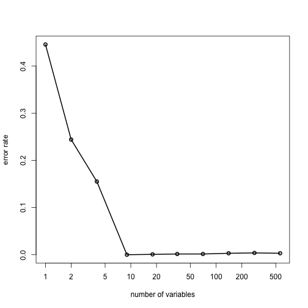

Project 2: analysis of Samsung S II motion data
========================================================

## Introduction
Smartphones are undoubtedly one of the most successful technologies of the last
few years, with hundreds of millions of units sold per year [1][]. Among many
other different characteristics, several models feature on-board accelerometer
and gyroscope. Generally speaking, these devices measure changes in the position
and the orientation of the phone, respectively. Their simplest application is
the adaptation of the screen orientation when the phone is rotated.
These accessories can also transform mobile phones into, for example,
compasses and levels, and more in general they allow the development of
movement-aware software. 

In this analysis, we study whether it is possible to accurately predict the
activity performed by a user from the acceleration and orientation of their
smartphone. To this end we analyzed the measures from the accelerometer and the
gyroscope of a smartphone (Samsung Galaxy S II) worn at the waist by 21
volunteers engaged in six different activities (walking, walking upstairs,
walking downstairs, sitting, standing, laying) [2][]. This analysis is an
example of supervised learning

We show that appropriate classification algorithms are able to correctly
predict the activity of the user in over 90% of the cases.

## Methods
### Data
The data were downloaded from the assignment webpage in the form of an R data
file, loaded and analysed with the R programming language[3][].
They consist of 7352 observations of 563 variables. Of these, 561 represent
various measurement from the accelerometer and the gyroscope, one variable
indicates the subject and one variable labels which of the activities the
user was performing.


```
## randomForest 4.6-7
```

```
## Type rfNews() to see new features/changes/bug fixes.
```

While the data from the original experiment are taken from 30 volunteers, the
data provided for the assignment only contain observations from 21. The sensors
embedded in the smartphone measure linear acceleration and angular velocity in
the 3 axes at a constant rate of 50 Hz. The 561 features reported come from
different pre-processing steps. For example, both time and frequency domain are
reported, for the axial components as well as for the total magnitude, summary
measures as maximum and minimum per time window and so on. All observations
are normalized to lie in the interval [-1, 1]. No missing values were found.


```r
max(samsungData[, -c(562, 563)])
```

```
## [1] 1
```

```r
min(samsungData[, -c(562, 563)])
```

```
## [1] -1
```

```r
length(unique(samsungData$subject))
```

```
## [1] 21
```

```r
names(samsungData)[1:10]
```

```
##  [1] "tBodyAcc-mean()-X" "tBodyAcc-mean()-Y" "tBodyAcc-mean()-Z"
##  [4] "tBodyAcc-std()-X"  "tBodyAcc-std()-Y"  "tBodyAcc-std()-Z" 
##  [7] "tBodyAcc-mad()-X"  "tBodyAcc-mad()-Y"  "tBodyAcc-mad()-Z" 
## [10] "tBodyAcc-max()-X"
```


### Data cleaning
Since the variable names contain several punctuation characters that are part
of the syntax in R (like parentheses), we substitute them with underscores.
Moreover, several variable names are repeated. This cannot be explained as an
accidental duplication of a column because the values are different. Rather
than removing these columns then, we renamed all variables to make them unique.

In order to avoid overfitting and obtain a fair estimate of the prediction
error, we split the data in two non-overlapping sets; one for training and one
for testing. In a real-life application this would translate in the fact that
a smartphone would be able to detect the activity of its user without the need
for a user calibration. According to the assignment, the training set contains
only observations from subjects 1, 3, 5 and 6, while the test set only those
from subjects 27, 28, 29 and 30.


```r
# reformat names and cure duplicates, activity as factor
names(samsungData) <- gsub("[[:punct:]]", "_", names(samsungData))
dyn_vars <- dim(samsungData)[2] - 2
suff <- paste0("_v", 1:dyn_vars)
names(samsungData)[1:dyn_vars] <- paste0(names(samsungData)[1:dyn_vars], suff)
samsungData$activity <- as.factor(samsungData$activity)
# split data in train and test sets
trainData <- subset(samsungData, subject == 1 | subject == 3 | subject == 5 | 
    subject == 6)
testData <- subset(samsungData, subject == 27 | subject == 28 | subject == 29 | 
    subject == 30)
```


### Predictive models
We tested the performance of two classifiers: decision trees, implemented in
the package `tree`[4][] and random forests, implemented in the package
`randomForest`[5][].

## Results

### Decision tree
We fitted a classification tree on all the dynamical observation in the
training set using the activity as response variable (and excluding the
subject index from the covariates). The misclassification error, measured on
the test set, is 18%.

```r
# decision tree prediction
samsung_tree <- tree(activity ~ ., data = trainData[, -562])
tree_preds <- predict(samsung_tree, testData[, -562], type = "class")
missClass(tree_preds, testData$activity)
```

```
## [1] 0.1805
```


### Random forest
We tried to achieve a lower misclassification error using the random forest
classifier, implemented in the package `randomForest`.

```r
# random forest predictionva
set.seed(123)
samsung_rf <- randomForest(activity ~ ., data = trainData[, -562], importance = TRUE, 
    proximity = TRUE, do.trace = FALSE)
rf_preds <- predict(samsung_rf, testData[, -562])
missClass(rf_preds, testData$activity)
```

```
## [1] 0.07138
```

The error achieved by running with default values (number of trees to grow equal
to 500) was 7.1%. Since the algorithm is stochastic in nature, we ran three
times changing the random number generator. We did not observe a significant
change in the misclassification error.

### Reducing the number of predictors
The package `randomForest` offers a function to compute, by means of
cross-validation, the performance of models with a reduced number of
predictors. The results are reported in Figure 1 and show that, already for 9
variables, the cross-validated misclassification error rate is lower than 1%.


```r
set.seed(456)
result <- rfcv(trainData[, -562], trainData$activity)
```


```r
plot(result$n.var, result$error.cv, log = "x", type = "o", lwd = 2, xlab = "number of variables", 
    ylab = "error rate")
```

 


We selected the 30 most important predictors by looking at the importance
output of the `randomForest` call, we fitted a new random forest with only
these predictors on the test set and assess the performance, achieving a
misclassification error of 11%.


```r
imp <- importance(samsung_rf)
names_reduced <- names(tail(sort(imp[, 7]), 30))
reduced_trainData <- cbind(trainData[, names_reduced], activity = trainData$activity)
red_rf <- randomForest(activity ~ ., data = reduced_trainData, importance = TRUE, 
    proximity = TRUE, do.trace = FALSE)
missClass(predict(red_rf, testData), testData$activity)
```

```
## [1] 0.1104
```


## Conclusions
We have analyzed linear acceleration and angular velocity measured by smartphones
and the possibility to use them to predict the activity performed by the user.
A decision tree achieves a misclassification error of 18%. A random forest, at
the expense of a longer computation time, brings down the error rate at 7.1%.
Further extension of this analysis might explore different classification
techniques, such as gradient boosting and neural networks.

[1]: http://finance.yahoo.com/news/samsung-dominates-android-trounces-apple-234600155.html
[2]: http://archive.ics.uci.edu/ml/datasets/Human+Activity+Recognition+Using+Smartphones
[3]: http://www.R-project.org
[4]: http://cran.r-project.org/web/packages/tree/index.html
[5]: http://cran.r-project.org/web/packages/randomForest/index.html
